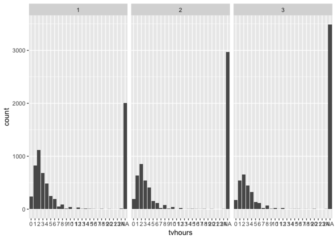
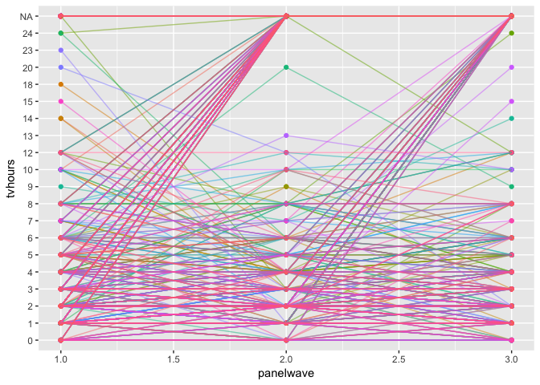

Panel Data Modeling
================
Sara Kim
5/30/2019

``` r
gss_all_original = readr::read_csv('./data/gss-all-panels-06-14.csv')

# Instead of removing ".d", ".i", ".n" I will alter them to NAs.
gss_all = readr::read_csv('./data/gss-all-panels-06-14.csv', na = c(".d", ".i", ".n")) %>%
  janitor::remove_empty_cols()
```

So in `gss_all`, I changed all “.d”, “.i”, “.n” to NAs and removed
columns that were all NAs.

changing orders in levels of
`tvhours`

``` r
gss_all$tvhours = gss_all$tvhours %>% factor(levels = c("0",  "1", "2", "3", "4",  "5",  "6",  "7",  "8",  "9", "10", "11", "12", "13", "14", "15", "16", "17", "18", "19", "20", "21", "23", "24"))
```

## Project Idea

When people express less confidence in a certain institution, do we see
them engaging with that institution less too? Confidence in institutions
has dropped dramatically, with implications for civil society, social
capital and public trust. Using two-way fixed effects models (that
control for stable, time-invariant characteristics of individuals), I
find some evidence that when people’s confidence in certain institutions
changes, so too does their participation and commitment to those
institutions. This is consistent with a theory that people’s opinions
and actions share some common basis and are not “uncoupled” from each
other. This appears true for confidence in TV, religion, business and
unions, but not so for confidence in the press or education. Using
random intercept cross-lagged SEMs, we can also test whether the
relationship is bi-directional or only goes one-way.

Let’s first explore the relationship between confidence in TV (`contv`)
and their daily TV watching habits (`tvhours`).

The variables we are going to focus is these two:

`CONTV`: I am going to name some institutions in this country. As far as
the people running these institutions are concerned, would you say you
have a great deal of confidence, only some confidence, or hardly any
confidence at all in them?

`TVHOURS`: On the average day, about how many hours do you personally
watch television?

## Data Exploration

First of all, let’s look at the size of our data.

``` r
dim(gss_all)
```

    ## [1] 18201  1521

``` r
unique(gss_all$idnum) %>% length()
```

    ## [1] 6067

There are data from 6067 participants.

### Frequency table

``` r
gss_all$tvhours %>% 
  table() %>%
  as.data.frame(col.names = values) %>%
  rename(., values = .) %>%
  mutate(Percent = Freq/sum(Freq)) %>%
  knitr::kable()
```

| values | Freq |   Percent |
| :----- | ---: | --------: |
| 0      |  608 | 0.0624102 |
| 1      | 2010 | 0.2063231 |
| 2      | 2626 | 0.2695545 |
| 3      | 1665 | 0.1709095 |
| 4      | 1220 | 0.1252310 |
| 5      |  549 | 0.0563539 |
| 6      |  434 | 0.0445494 |
| 7      |   96 | 0.0098542 |
| 8      |  238 | 0.0244303 |
| 9      |   25 | 0.0025662 |
| 10     |  103 | 0.0105728 |
| 11     |    5 | 0.0005132 |
| 12     |   76 | 0.0078013 |
| 13     |    6 | 0.0006159 |
| 14     |   15 | 0.0015397 |
| 15     |   13 | 0.0013344 |
| 16     |    9 | 0.0009238 |
| 17     |    4 | 0.0004106 |
| 18     |   11 | 0.0011291 |
| 19     |    1 | 0.0001026 |
| 20     |   11 | 0.0011291 |
| 21     |    1 | 0.0001026 |
| 23     |    1 | 0.0001026 |
| 24     |   15 | 0.0015397 |

``` r
gss_all$contv %>% 
  table() %>%
  as.data.frame(col.names = values) %>%
  rename(., values = .) %>%
  mutate(Percent = Freq/sum(Freq)) %>%
  knitr::kable()
```

| values    |    Freq |                                                                                                                  Percent |
| :-------- | ------: | -----------------------------------------------------------------------------------------------------------------------: |
| 1         |     877 |                                                                                                                0.0903565 |
| 2         |    4887 |                                                                                                                0.5035030 |
| 3         |    3942 |                                                                                                                0.4061405 |
| I made Fr | equency | tables for the two variables. Let’s see summary statistics for `tvhours` by considering `tvhours` as a numeric variable. |

``` r
gss_all$tvhours %>% 
  as.numeric() %>%
  Hmisc::describe()
```

    ## . 
    ##        n  missing distinct     Info     Mean      Gmd      .05      .10 
    ##     9742     8459       24    0.964    3.957    2.392        1        2 
    ##      .25      .50      .75      .90      .95 
    ##        2        3        5        7        9 
    ## 
    ## lowest :  1  2  3  4  5, highest: 20 21 22 23 24

I will plot the two variables for each `panelwave` and see if the
distribution changes depending on the wave.

``` r
 gss_all %>%
  ggplot(aes(x=contv)) +
  geom_bar(stat="count") + 
  facet_grid(. ~ panelwave)
```

    ## Warning: Removed 8495 rows containing non-finite values (stat_count).

<!-- -->

``` r
 gss_all %>%
  ggplot(aes(x=tvhours)) +
  geom_bar(stat="count") + 
  facet_grid(. ~ panelwave)
```

<!-- -->

Seems like there is no apparent difference in the trends among the three
panels.

``` r
set.seed(100) 

gss_all %>%
  filter(idnum %in% (gss_all$idnum %>% sample(1000))) %>%
  mutate(idnum = factor(idnum)) %>%
  ggplot(aes(x = panelwave, y = tvhours, group = idnum, color = idnum)) +
  geom_point() + geom_line(alpha = 0.5) + theme(legend.position="none")
```

<!-- -->

Just sampled 1000 participants to see if there is a pattern.

### Correlation

Below is a correlation matrix between `contv` and `tvhours` for the
first wave. I removed non-numeric values and altered the variables to be
numeric to see the relationship.

``` r
gss_all %>%
  mutate(contv = as.numeric(contv),
         tvhours = as.numeric(tvhours)) %>%
  select(tvhours, contv) %>%
  cor(use="complete.obs")
```

    ##            tvhours      contv
    ## tvhours  1.0000000 -0.2148965
    ## contv   -0.2148965  1.0000000

``` r
gss_all %>%
  filter(panelwave == 1) %>%
  mutate(contv = as.numeric(contv),
         tvhours = as.numeric(tvhours)) %>%
  select(tvhours, contv) %>%
  cor(use="complete.obs")
```

    ##            tvhours      contv
    ## tvhours  1.0000000 -0.2085649
    ## contv   -0.2085649  1.0000000

``` r
library(purrr)
gss_numeric = map_df(gss_all, as.numeric) 
```

    ## Warning in .Primitive("as.double")(x, ...): NAs introduced by coercion
    
    ## Warning in .Primitive("as.double")(x, ...): NAs introduced by coercion
    
    ## Warning in .Primitive("as.double")(x, ...): NAs introduced by coercion
    
    ## Warning in .Primitive("as.double")(x, ...): NAs introduced by coercion
    
    ## Warning in .Primitive("as.double")(x, ...): NAs introduced by coercion
    
    ## Warning in .Primitive("as.double")(x, ...): NAs introduced by coercion
    
    ## Warning in .Primitive("as.double")(x, ...): NAs introduced by coercion
    
    ## Warning in .Primitive("as.double")(x, ...): NAs introduced by coercion
    
    ## Warning in .Primitive("as.double")(x, ...): NAs introduced by coercion
    
    ## Warning in .Primitive("as.double")(x, ...): NAs introduced by coercion
    
    ## Warning in .Primitive("as.double")(x, ...): NAs introduced by coercion
    
    ## Warning in .Primitive("as.double")(x, ...): NAs introduced by coercion
    
    ## Warning in .Primitive("as.double")(x, ...): NAs introduced by coercion
    
    ## Warning in .Primitive("as.double")(x, ...): NAs introduced by coercion
    
    ## Warning in .Primitive("as.double")(x, ...): NAs introduced by coercion
    
    ## Warning in .Primitive("as.double")(x, ...): NAs introduced by coercion
    
    ## Warning in .Primitive("as.double")(x, ...): NAs introduced by coercion
    
    ## Warning in .Primitive("as.double")(x, ...): NAs introduced by coercion

``` r
gss_numeric_p1 = gss_numeric %>%
  filter(panelwave == 1)

panel1_cor = cor(gss_numeric_p1, use="p")
```

    ## Warning in cor(gss_numeric_p1, use = "p"): the standard deviation is zero

``` r
contv_cor = panel1_cor  %>%
  as.data.frame() %>%
  select(contv) %>%
  rownames_to_column('var') %>% 
  filter(contv > 0.25)

contv_cor
```

    ##         var     contv
    ## 1  conpress 0.3643897
    ## 2     contv 1.0000000
    ## 3   extrayr 0.2644225
    ## 4  gender12 0.3475240
    ## 5     old12 0.3378125
    ## 6  relate10 1.0000000
    ## 7   relate8 0.4881873
    ## 8   relate9 0.7559289
    ## 9   relhh10 1.0000000
    ## 10   relhh8 0.3505332
    ## 11 relhhd10 1.0000000
    ## 12  relhhd8 0.3952847
    ## 13  relhhd9 0.7559289
    ## 14  relsp11 0.2573755
    ## 15  relsp12 0.3054485
    ## 16   relsp8 0.2778908
    ## 17 bizshare 0.3162278

Above is a pearson correlation coefficient with `contv` with all the
other variables. I have filtered out those that are above 0.2.

Should take out some variables. Like idnum, panelwave, …

Lot of relate vars have cor value of 1. Why?

``` r
gss_numeric_p1 %>%
  select(contv_cor$var) %>%
  select(starts_with('rel'))
```

    ## # A tibble: 6,067 x 11
    ##    relate10 relate8 relate9 relhh10 relhh8 relhhd10 relhhd8 relhhd9 relsp11
    ##       <dbl>   <dbl>   <dbl>   <dbl>  <dbl>    <dbl>   <dbl>   <dbl>   <dbl>
    ##  1       NA      NA      NA      NA     NA       NA      NA      NA      NA
    ##  2       NA      NA      NA      NA     NA       NA      NA      NA      NA
    ##  3       NA      NA      NA      NA     NA       NA      NA      NA      NA
    ##  4       NA      NA      NA      NA     NA       NA      NA      NA      NA
    ##  5       NA      NA      NA      NA     NA       NA      NA      NA      NA
    ##  6       NA      NA      NA      NA     NA       NA      NA      NA      NA
    ##  7       NA      NA      NA      NA     NA       NA      NA      NA      NA
    ##  8       NA      NA      NA      NA     NA       NA      NA      NA      NA
    ##  9       NA      NA      NA      NA     NA       NA      NA      NA      NA
    ## 10       NA      NA      NA      NA     NA       NA      NA      NA      NA
    ## # … with 6,057 more rows, and 2 more variables: relsp12 <dbl>,
    ## #   relsp8 <dbl>

Seems like these columns are very sparse. Should I remove sparse
columns?

``` r
#library(lsr)
#gss_all %>% filter(panelwave == 1) %>% correlate() %>% focus(contv) %>% arrange(tvhours)
```

``` r
library(Amelia)
```

    ## Loading required package: Rcpp

    ## Warning: package 'Rcpp' was built under R version 3.5.2

    ## ## 
    ## ## Amelia II: Multiple Imputation
    ## ## (Version 1.7.5, built: 2018-05-07)
    ## ## Copyright (C) 2005-2019 James Honaker, Gary King and Matthew Blackwell
    ## ## Refer to http://gking.harvard.edu/amelia/ for more information
    ## ##

``` r
gss_numeric_p1 %>%
  select(contv_cor$var) %>%
  is.na() %>%
  as.data.frame() %>%
  map(sum)
```

    ## $conpress
    ## [1] 2048
    ## 
    ## $contv
    ## [1] 2041
    ## 
    ## $extrayr
    ## [1] 6013
    ## 
    ## $gender12
    ## [1] 6049
    ## 
    ## $old12
    ## [1] 6047
    ## 
    ## $relate10
    ## [1] 6058
    ## 
    ## $relate8
    ## [1] 6037
    ## 
    ## $relate9
    ## [1] 6053
    ## 
    ## $relhh10
    ## [1] 6058
    ## 
    ## $relhh8
    ## [1] 6037
    ## 
    ## $relhhd10
    ## [1] 6058
    ## 
    ## $relhhd8
    ## [1] 6037
    ## 
    ## $relhhd9
    ## [1] 6053
    ## 
    ## $relsp11
    ## [1] 6031
    ## 
    ## $relsp12
    ## [1] 6057
    ## 
    ## $relsp8
    ## [1] 6042
    ## 
    ## $bizshare
    ## [1] 6055

I counted missings in each variables. Considering there are 6067 rows,
most of the variables are very sparse columns.
