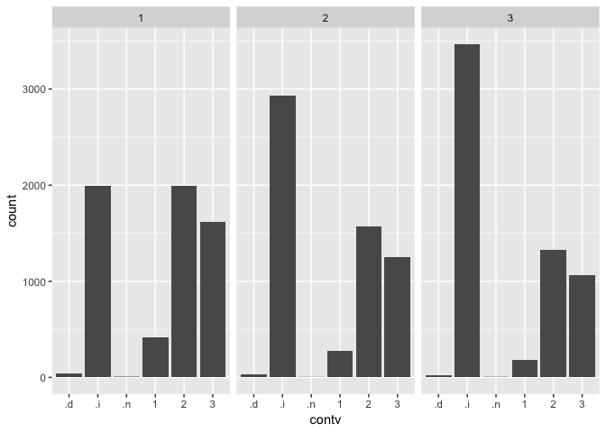
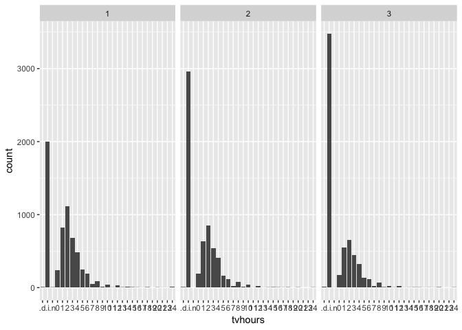
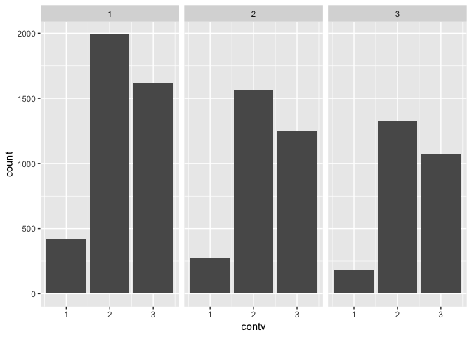

Panel Data Modeling
================
Sara Kim
5/30/2019

``` r
gss_all = read.csv('./data/gss-all-panels-06-14.csv')
```

changing orders in levels of
`tvhours`

``` r
gss_all$tvhours = gss_all$tvhours %>% factor(levels = c(".d", ".i", ".n", "0",  "1", "2", "3", "4",  "5",  "6",  "7",  "8",  "9", "10", "11", "12", "13", "14", "15", "16", "17", "18", "19", "20", "21", "23", "24"))
```

## Project Idea

When people express less confidence in a certain institution, do we see
them engaging with that institution less too? Confidence in institutions
has dropped dramatically, with implications for civil society, social
capital and public trust. Using two-way fixed effects models (that
control for stable, time-invariant characteristics of individuals), I
find some evidence that when people’s confidence in certain institutions
changes, so too does their participation and commitment to those
institutions. This is consistent with a theory that people’s opinions
and actions share some common basis and are not “uncoupled” from each
other. This appears true for confidence in TV, religion, business and
unions, but not so for confidence in the press or education. Using
random intercept cross-lagged SEMs, we can also test whether the
relationship is bi-directional or only goes one-way.

Let’s first explore the relationship between confidence in TV (`contv`)
and their daily TV watching habits (`tvhours`).

The variables we are going to focus is these two:

`CONTV`: I am going to name some institutions in this country. As far as
the people running these institutions are concerned, would you say you
have a great deal of confidence, only some confidence, or hardly any
confidence at all in them?

`TVHOURS`: On the average day, about how many hours do you personally
watch television?

## Data Exploration

First of all, let’s look at the size of our data.

``` r
dim(gss_all)
```

    ## [1] 18201  1578

``` r
unique(gss_all$idnum) %>% length()
```

    ## [1] 6067

There are data from 6067 participants. \#\#\#\# question: what are .d,
.i, .n???

### frequency table

``` r
gss_all$tvhours %>% 
  table() %>%
  knitr::kable()
```

| .  | Freq |
| :- | ---: |
| .d |   23 |
| .i | 8431 |
| .n |    5 |
| 0  |  608 |
| 1  | 2010 |
| 2  | 2626 |
| 3  | 1665 |
| 4  | 1220 |
| 5  |  549 |
| 6  |  434 |
| 7  |   96 |
| 8  |  238 |
| 9  |   25 |
| 10 |  103 |
| 11 |    5 |
| 12 |   76 |
| 13 |    6 |
| 14 |   15 |
| 15 |   13 |
| 16 |    9 |
| 17 |    4 |
| 18 |   11 |
| 19 |    1 |
| 20 |   11 |
| 21 |    1 |
| 23 |    1 |
| 24 |   15 |

``` r
gss_all$contv %>% 
  table() %>%
  knitr::kable()
```

| .  | Freq |
| :- | ---: |
| .d |   92 |
| .i | 8393 |
| .n |   10 |
| 1  |  877 |
| 2  | 4887 |
| 3  | 3942 |

I will plot the two variables for each `panelwave` and see if the
distribution changes depending on the wave.

``` r
 gss_all %>%
  ggplot(aes(x=contv)) +
  geom_bar(stat="count") + 
  facet_grid(. ~ panelwave)
```

<!-- -->

``` r
 gss_all %>%
  ggplot(aes(x=tvhours)) +
  geom_bar(stat="count") + 
  facet_grid(. ~ panelwave)
```

<!-- -->

``` r
set.seed(100) 

gss_all %>%
  filter(idnum %in% (gss_all$idnum %>% sample(1000))) %>%
  mutate(idnum = factor(idnum)) %>%
  ggplot(aes(x = panelwave, y = tvhours, group = idnum, color = idnum)) +
  geom_point() + geom_line(alpha = 0.5) + theme(legend.position="none")
```

<!-- --> Just sampled
1000 participants to see if there is a pattern.

Below is a correlation matrix between `contv` and `tvhours` for the
first wave. I removed non-numeric values and altered the variables to be
numeric to see the relationship.

``` r
gss_all %>%
  filter(!(contv %in% c('.d', '.i', '.n')) & !(tvhours %in% c('.d', '.i', '.n')) & panelwave == 1) %>%
  mutate(contv = as.numeric(contv),
         tvhours = as.numeric(tvhours)) %>%
  select(tvhours, contv) %>%
  cor()
```

    ##            tvhours      contv
    ## tvhours  1.0000000 -0.2085649
    ## contv   -0.2085649  1.0000000

``` r
#library(lsr)
#gss_all %>% filter(panelwave == 1) %>% correlate() %>% focus(contv) %>% arrange(tvhours)
```
