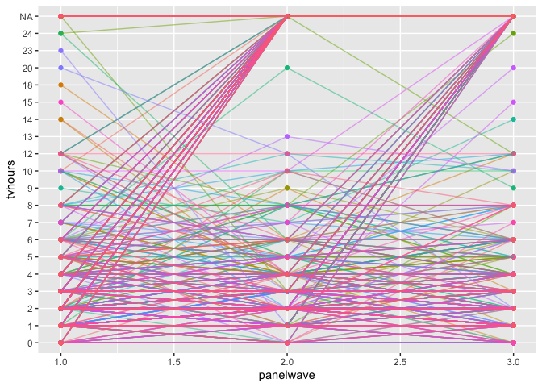

Panel Data Modeling
================
Sara Kim
5/30/2019

``` r
gss_all_original = readr::read_csv('./data/gss-all-panels-06-14.csv')

# Instead of removing ".d", ".i", ".n" I will alter them to NAs.
gss_all = readr::read_csv('./data/gss-all-panels-06-14.csv', na = c(".d", ".i", ".n")) %>%
  janitor::remove_empty_cols()
```

So in `gss_all`, I changed all “.d”, “.i”, “.n” to NAs and removed
columns that were all NAs.

To go further, I will remove sparse columns as there seems to be many. I
will set the preliminary threshold as features having more than 90% as
missings (values: “.d”, “.i”, “.n”).

I won’t remove variables regarding confidence in institution.

``` r
removed = c()
dont_remove = grep("^con", names(gss_all), value=TRUE)

for(col in colnames(gss_all)){
  na_percent = gss_all[[col]] %>% is.na() %>% mean()
  if(na_percent > 0.9) {
    if(!(col %in% dont_remove)){
    removed = c(removed, col)
    gss_all = gss_all %>% select(-col)
    }
  }
}
```

I see that we now have removed 999 variables and there are 522 variables
in `gss_all`.

#### todo check removed variables

Notice that some of the `con-` variables are very sparse for instance,
`conbiz` has 99.8% missings.

``` r
gss_all %>% select(conbiz) %>% is.na() %>% mean()
```

    ## [1] 0.998077

changing orders in levels of `tvhours` so that they will be in numerical
order.

``` r
gss_all$tvhours = gss_all$tvhours %>% factor(levels = c("0",  "1", "2", "3", "4",  "5",  "6",  "7",  "8",  "9", "10", "11", "12", "13", "14", "15", "16", "17", "18", "19", "20", "21", "23", "24"))
```

## Project Idea

When people express less confidence in a certain institution, do we see
them engaging with that institution less too? Confidence in institutions
has dropped dramatically, with implications for civil society, social
capital and public trust. Using two-way fixed effects models (that
control for stable, time-invariant characteristics of individuals), I
find some evidence that when people’s confidence in certain institutions
changes, so too does their participation and commitment to those
institutions. This is consistent with a theory that people’s opinions
and actions share some common basis and are not “uncoupled” from each
other. This appears true for confidence in TV, religion, business and
unions, but not so for confidence in the press or education. Using
random intercept cross-lagged SEMs, we can also test whether the
relationship is bi-directional or only goes one-way.

Let’s first explore the relationship between confidence in TV (`contv`)
and their daily TV watching habits (`tvhours`).

The variables we are going to focus is these two:

`CONTV`: I am going to name some institutions in this country. As far as
the people running these institutions are concerned, would you say you
have a great deal of confidence, only some confidence, or hardly any
confidence at all in them?

`TVHOURS`: On the average day, about how many hours do you personally
watch television?

## Data Exploration

First of all, let’s look at the size of our data.

``` r
dim(gss_all)
```

    ## [1] 18201   522

``` r
unique(gss_all$idnum) %>% length()
```

    ## [1] 6067

There are data from 6067 participants.

### Frequency table

``` r
gss_all$tvhours %>% 
  table() %>%
  as.data.frame(col.names = values) %>%
  rename(., values = .) %>%
  mutate(Percent = Freq/sum(Freq)) %>%
  knitr::kable()
```

| values | Freq |   Percent |
| :----- | ---: | --------: |
| 0      |  608 | 0.0624102 |
| 1      | 2010 | 0.2063231 |
| 2      | 2626 | 0.2695545 |
| 3      | 1665 | 0.1709095 |
| 4      | 1220 | 0.1252310 |
| 5      |  549 | 0.0563539 |
| 6      |  434 | 0.0445494 |
| 7      |   96 | 0.0098542 |
| 8      |  238 | 0.0244303 |
| 9      |   25 | 0.0025662 |
| 10     |  103 | 0.0105728 |
| 11     |    5 | 0.0005132 |
| 12     |   76 | 0.0078013 |
| 13     |    6 | 0.0006159 |
| 14     |   15 | 0.0015397 |
| 15     |   13 | 0.0013344 |
| 16     |    9 | 0.0009238 |
| 17     |    4 | 0.0004106 |
| 18     |   11 | 0.0011291 |
| 19     |    1 | 0.0001026 |
| 20     |   11 | 0.0011291 |
| 21     |    1 | 0.0001026 |
| 23     |    1 | 0.0001026 |
| 24     |   15 | 0.0015397 |

``` r
gss_all$contv %>% 
  table() %>%
  as.data.frame(col.names = values) %>%
  rename(., values = .) %>%
  mutate(Percent = Freq/sum(Freq)) %>%
  knitr::kable()
```

| values | Freq |   Percent |
| :----- | ---: | --------: |
| 1      |  877 | 0.0903565 |
| 2      | 4887 | 0.5035030 |
| 3      | 3942 | 0.4061405 |

I made Frequency tables for the two variables. Let’s see summary
statistics for `tvhours` by considering `tvhours` as a numeric variable.

``` r
gss_all$tvhours %>% 
  as.numeric() %>%
  Hmisc::describe()
```

    ## . 
    ##        n  missing distinct     Info     Mean      Gmd      .05      .10 
    ##     9742     8459       24    0.964    3.957    2.392        1        2 
    ##      .25      .50      .75      .90      .95 
    ##        2        3        5        7        9 
    ## 
    ## lowest :  1  2  3  4  5, highest: 20 21 22 23 24

I will plot the two variables for each `panelwave` and see if the
distribution changes depending on the wave.

``` r
 gss_all %>%
  ggplot(aes(x=contv)) +
  geom_bar(stat="count") + 
  facet_grid(. ~ panelwave)
```

    ## Warning: Removed 8495 rows containing non-finite values (stat_count).

<!-- -->

``` r
 gss_all %>%
  ggplot(aes(x=tvhours)) +
  geom_bar(stat="count") + 
  facet_grid(. ~ panelwave)
```

<!-- -->

Seems like there is no apparent difference in the trends among the three
panels.

``` r
set.seed(100) 

gss_all %>%
  filter(idnum %in% (gss_all$idnum %>% sample(1000))) %>%
  mutate(idnum = factor(idnum)) %>%
  ggplot(aes(x = panelwave, y = tvhours, group = idnum, color = idnum)) +
  geom_point() + geom_line(alpha = 0.5) + theme(legend.position="none")
```

<!-- -->

Just sampled 1000 participants to see if there is a pattern.

### Correlation

Below is a correlation matrix between `contv` and `tvhours` for the
first wave. I removed non-numeric values and altered the variables to be
numeric to see the relationship.

``` r
# just panel 1

gss_numeric = map_df(gss_all, as.numeric) 
```

    ## Warning in .Primitive("as.double")(x, ...): NAs introduced by coercion
    
    ## Warning in .Primitive("as.double")(x, ...): NAs introduced by coercion
    
    ## Warning in .Primitive("as.double")(x, ...): NAs introduced by coercion
    
    ## Warning in .Primitive("as.double")(x, ...): NAs introduced by coercion
    
    ## Warning in .Primitive("as.double")(x, ...): NAs introduced by coercion
    
    ## Warning in .Primitive("as.double")(x, ...): NAs introduced by coercion
    
    ## Warning in .Primitive("as.double")(x, ...): NAs introduced by coercion
    
    ## Warning in .Primitive("as.double")(x, ...): NAs introduced by coercion
    
    ## Warning in .Primitive("as.double")(x, ...): NAs introduced by coercion
    
    ## Warning in .Primitive("as.double")(x, ...): NAs introduced by coercion
    
    ## Warning in .Primitive("as.double")(x, ...): NAs introduced by coercion
    
    ## Warning in .Primitive("as.double")(x, ...): NAs introduced by coercion
    
    ## Warning in .Primitive("as.double")(x, ...): NAs introduced by coercion
    
    ## Warning in .Primitive("as.double")(x, ...): NAs introduced by coercion
    
    ## Warning in .Primitive("as.double")(x, ...): NAs introduced by coercion
    
    ## Warning in .Primitive("as.double")(x, ...): NAs introduced by coercion
    
    ## Warning in .Primitive("as.double")(x, ...): NAs introduced by coercion
    
    ## Warning in .Primitive("as.double")(x, ...): NAs introduced by coercion

``` r
gss_numeric_p1 = gss_numeric %>%
  filter(panelwave == 1)

# cor matrix between contv and tvhours
gss_numeric_p1  %>%
  select(tvhours, contv) %>%
  cor(use="complete.obs")
```

    ##            tvhours      contv
    ## tvhours  1.0000000 -0.2085649
    ## contv   -0.2085649  1.0000000

``` r
panel1_cor = cor(gss_numeric_p1, use="p")
```

    ## Warning in cor(gss_numeric_p1, use = "p"): the standard deviation is zero

``` r
contv_cor = panel1_cor  %>%
  as.data.frame() %>%
  select(contv) %>%
  rownames_to_column('var') %>% 
  filter(abs(contv) > 0.2)

# negatively corr check
# check top ten? five?
# try ten% 
# put in the y var in amelia

contv_cor
```

    ##        var      contv
    ## 1 conmedic  0.2016988
    ## 2 conpress  0.3643897
    ## 3    contv  1.0000000
    ## 4  tvhours -0.2085649

Above is a pearson correlation coefficient with `contv` with all the
other variables. I have filtered out those that are above 0.2 or below
-0.2.

Let’s get top 10 vars correlated to `tvhours` and `contv` with
`correlate()` from `corrr` package.

#### look correlation on whole dataset? Or just wave 1?

``` r
library(corrr)
```

    ## Warning: package 'corrr' was built under R version 3.5.2

``` r
# function for finding top n correlated variables 
corr_var = function(df, col, n = 10){
  
  col = enquo(col)
  
  top_n = df  %>% correlate() %>% select(rowname, !! col )  %>% top_n(n, abs(!!col))
  top_n %>% arrange(desc(abs(!!col)))
  }

# top 10 correlated vars to contv
cor_contv = corr_var(gss_numeric_p1, contv, 10)
```

    ## Warning in stats::cor(x = x, y = y, use = use, method = method): the
    ## standard deviation is zero

    ## 
    ## Correlation method: 'pearson'
    ## Missing treated using: 'pairwise.complete.obs'

``` r
corr_var(gss_numeric, contv, 10)
```

    ## Warning in stats::cor(x = x, y = y, use = use, method = method): the
    ## standard deviation is zero

    ## 
    ## Correlation method: 'pearson'
    ## Missing treated using: 'pairwise.complete.obs'

    ## # A tibble: 10 x 2
    ##    rowname   contv
    ##    <chr>     <dbl>
    ##  1 conpress  0.369
    ##  2 tvhours  -0.215
    ##  3 confinan  0.208
    ##  4 conlegis  0.206
    ##  5 conmedic  0.194
    ##  6 coneduc   0.184
    ##  7 conlabor  0.171
    ##  8 conjudge  0.163
    ##  9 conbus    0.161
    ## 10 confed    0.160

``` r
cor_tvhours = corr_var(gss_numeric_p1, tvhours, 10)
```

    ## Warning in stats::cor(x = x, y = y, use = use, method = method): the
    ## standard deviation is zero

    ## 
    ## Correlation method: 'pearson'
    ## Missing treated using: 'pairwise.complete.obs'

To do analysis, I will impute not just on the first panel but on the
whole dataset.

I tried to get imputed factor variables but I am getting errors. I will
impute numeric variables.

``` r
imputed_contv = gss_numeric %>%
  select(idnum, panelwave, contv, cor_contv$rowname) %>%
  amelia(idvars = "idnum", ts = "panelwave", ords = c("contv", "conpress", "tvhours", "conmedic", "confinan", "coneduc", "fejobaff", "conlabor", "wordsum", "conlegis", "conjudge"))
```

    ## Warning: There are observations in the data that are completely missing. 
    ##          These observations will remain unimputed in the final datasets. 
    ## -- Imputation 1 --
    ## 
    ##   1  2  3  4  5  6  7  8  9 10 11 12 13 14 15 16 17 18 19 20
    ##  21 22 23 24 25 26
    ## 
    ## -- Imputation 2 --
    ## 
    ##   1  2  3  4  5  6  7  8  9 10 11 12 13 14 15 16 17 18 19 20
    ##  21 22 23 24 25
    ## 
    ## -- Imputation 3 --
    ## 
    ##   1  2  3  4  5  6  7  8  9 10 11 12 13 14 15 16 17 18 19 20
    ##  21 22
    ## 
    ## -- Imputation 4 --
    ## 
    ##   1  2  3  4  5  6  7  8  9 10 11 12 13 14 15 16 17 18 19 20
    ##  21 22 23
    ## 
    ## -- Imputation 5 --
    ## 
    ##   1  2  3  4  5  6  7  8  9 10 11 12 13 14 15 16 17 18 19 20
    ##  21 22 23 24 25 26

``` r
imputed_contv = bind_rows(unclass(imputed_contv$imputations), .id = "m") %>%
  group_by(m) %>%
  nest()
```

There are still lot of NAs because some rows in waves 2 and three are
completely missing. I will try to impute a wide formatted data.

``` r
# change the data to a wide format
long_to_wide = function(df){
  df %>% 
  gather(key, value, -idnum, -panelwave) %>%  
     unite(new.col, c(key, panelwave)) %>%   
     spread(new.col, value) 
}

contv_wide = list()
for(i in c(1:5)){
  contv_wide[[i]] = imputed_contv[[2]][[i]] %>%
    long_to_wide()
}

names(contv_wide[[1]])[-1]
```

    ##  [1] "coneduc_1"  "coneduc_2"  "coneduc_3"  "confinan_1" "confinan_2"
    ##  [6] "confinan_3" "conjudge_1" "conjudge_2" "conjudge_3" "conlabor_1"
    ## [11] "conlabor_2" "conlabor_3" "conlegis_1" "conlegis_2" "conlegis_3"
    ## [16] "conmedic_1" "conmedic_2" "conmedic_3" "conpress_1" "conpress_2"
    ## [21] "conpress_3" "contv_1"    "contv_2"    "contv_3"    "fejobaff_1"
    ## [26] "fejobaff_2" "fejobaff_3" "tvhours_1"  "tvhours_2"  "tvhours_3" 
    ## [31] "wordsum_1"  "wordsum_2"  "wordsum_3"

``` r
# impute wide data
imputed_wide = contv_wide[[1]]%>%
  amelia(idvars = "idnum", ords = names(contv_wide[[1]])[-1]) 
```

    ## Warning: There are observations in the data that are completely missing. 
    ##          These observations will remain unimputed in the final datasets. 
    ## -- Imputation 1 --
    ## 
    ##   1  2  3  4  5  6
    ## 
    ## -- Imputation 2 --
    ## 
    ##   1  2  3  4  5
    ## 
    ## -- Imputation 3 --
    ## 
    ##   1  2  3  4  5
    ## 
    ## -- Imputation 4 --
    ## 
    ##   1  2  3  4  5  6
    ## 
    ## -- Imputation 5 --
    ## 
    ##   1  2  3  4  5  6

``` r
imputed_wide = bind_rows(unclass(imputed_wide$imputations), .id = "m") %>%
  group_by(m) %>%
  nest()

# rows to remove
imputed_wide[[2]][[1]][!complete.cases(imputed_wide[[2]][[1]]), ]
```

    ## # A tibble: 2 x 34
    ##   idnum coneduc_1 coneduc_2 coneduc_3 confinan_1 confinan_2 confinan_3
    ##   <dbl>     <dbl>     <dbl>     <dbl>      <dbl>      <dbl>      <dbl>
    ## 1  6627        NA        NA        NA         NA         NA         NA
    ## 2  7692        NA        NA        NA         NA         NA         NA
    ## # … with 27 more variables: conjudge_1 <dbl>, conjudge_2 <dbl>,
    ## #   conjudge_3 <dbl>, conlabor_1 <dbl>, conlabor_2 <dbl>,
    ## #   conlabor_3 <dbl>, conlegis_1 <dbl>, conlegis_2 <dbl>,
    ## #   conlegis_3 <dbl>, conmedic_1 <dbl>, conmedic_2 <dbl>,
    ## #   conmedic_3 <dbl>, conpress_1 <dbl>, conpress_2 <dbl>,
    ## #   conpress_3 <dbl>, contv_1 <dbl>, contv_2 <dbl>, contv_3 <dbl>,
    ## #   fejobaff_1 <dbl>, fejobaff_2 <dbl>, fejobaff_3 <dbl>, tvhours_1 <dbl>,
    ## #   tvhours_2 <dbl>, tvhours_3 <dbl>, wordsum_1 <dbl>, wordsum_2 <dbl>,
    ## #   wordsum_3 <dbl>

``` r
imputed = imputed_wide[[2]][[1]]

imputed_contv[[2]][[1]] %>% names()
```

    ##  [1] "idnum"     "panelwave" "contv"     "conpress"  "tvhours"  
    ##  [6] "conmedic"  "confinan"  "conlegis"  "coneduc"   "fejobaff" 
    ## [11] "conlabor"  "wordsum"   "conjudge"

``` r
wide_to_long = function(df){
  df %>% 
    gather(name, value, -idnum) %>%
    separate(name, into=c("name", "id"), sep= -2) %>%
    spread(key=c(name), value) %>%
    separate(id, into = c("remove", "panelwave"), sep = -1) %>%
    select(-remove)
}
```

## Modeling

Run fixed effects models. Run “within and between” models. Trying
multinomial fixed effects models.

Fixed effects models from the survival package.

``` r
library(survival)

fe_contv = 
  imputed %>%
  wide_to_long() %>%
  mutate(panelwave = as.numeric(panelwave)) %>%
  clogit(tvhours ~ contv + panelwave + conpress + conmedic + confinan + conlegis + coneduc + fejobaff + conlabor + wordsum + conjudge + strata(idnum), data = ., method = "efron")
```

    ## Warning in Surv(rep(1, 18201L), tvhours): Invalid status value, converted
    ## to NA

    ## Warning in fitter(X, Y, strats, offset, init, control, weights = weights, :
    ## Ran out of iterations and did not converge

``` r
summary(fe_contv)
```

    ## Call:
    ## coxph(formula = Surv(rep(1, 18201L), tvhours) ~ contv + panelwave + 
    ##     conpress + conmedic + confinan + conlegis + coneduc + fejobaff + 
    ##     conlabor + wordsum + conjudge + strata(idnum), data = ., 
    ##     method = "efron")
    ## 
    ##   n= 2459, number of events= 2459 
    ##    (15742 observations deleted due to missingness)
    ## 
    ##                 coef  exp(coef)   se(coef) z Pr(>|z|)
    ## contv     -4.942e-23  1.000e+00  6.696e-02 0        1
    ## panelwave -4.136e-24  1.000e+00  4.201e-02 0        1
    ## conpress   2.602e-23  1.000e+00  6.733e-02 0        1
    ## conmedic  -5.210e-24  1.000e+00  6.458e-02 0        1
    ## confinan   3.850e-23  1.000e+00  6.308e-02 0        1
    ## conlegis  -1.944e-23  1.000e+00  6.823e-02 0        1
    ## coneduc   -6.085e-23  1.000e+00  6.091e-02 0        1
    ## fejobaff   2.783e-24  1.000e+00  3.952e-02 0        1
    ## conlabor   2.347e-23  1.000e+00  6.182e-02 0        1
    ## wordsum   -2.932e-24  1.000e+00  2.106e-02 0        1
    ## conjudge   6.542e-23  1.000e+00  6.453e-02 0        1
    ## 
    ##           exp(coef) exp(-coef) lower .95 upper .95
    ## contv             1          1    0.8770     1.140
    ## panelwave         1          1    0.9210     1.086
    ## conpress          1          1    0.8764     1.141
    ## conmedic          1          1    0.8811     1.135
    ## confinan          1          1    0.8837     1.132
    ## conlegis          1          1    0.8748     1.143
    ## coneduc           1          1    0.8875     1.127
    ## fejobaff          1          1    0.9255     1.081
    ## conlabor          1          1    0.8859     1.129
    ## wordsum           1          1    0.9596     1.042
    ## conjudge          1          1    0.8812     1.135
    ## 
    ## Concordance= NaN  (se = NaN )
    ## Rsquare= -0.001   (max possible= 0.322 )
    ## Likelihood ratio test= -2.2  on 11 df,   p=1
    ## Wald test            = 0  on 11 df,   p=1
    ## Score (logrank) test = 0  on 11 df,   p=1

With imputed data that has na rows

``` r
library(broom)
```

    ## Warning: package 'broom' was built under R version 3.5.2

``` r
models_imputations <- imputed_contv  %>%
  mutate(model = data %>% map(~ clogit(tvhours ~ contv + panelwave + conpress + conmedic + confinan + conlegis + coneduc + fejobaff + conlabor + wordsum + conjudge + strata(idnum), data = ., method = "efron")),
         tidied = model %>% map(~ tidy(., conf.int = TRUE)),
         glance = model %>% map(~ glance(.)))
```

    ## Warning in Surv(rep(1, 18201L), tvhours): Invalid status value, converted
    ## to NA

    ## Warning in fitter(X, Y, strats, offset, init, control, weights = weights, :
    ## Ran out of iterations and did not converge

    ## Warning in Surv(rep(1, 18201L), tvhours): Invalid status value, converted
    ## to NA

    ## Warning in fitter(X, Y, strats, offset, init, control, weights = weights, :
    ## Ran out of iterations and did not converge

    ## Warning in Surv(rep(1, 18201L), tvhours): Invalid status value, converted
    ## to NA
    
    ## Warning in Surv(rep(1, 18201L), tvhours): Invalid status value, converted
    ## to NA

    ## Warning in fitter(X, Y, strats, offset, init, control, weights = weights, :
    ## Ran out of iterations and did not converge

    ## Warning in Surv(rep(1, 18201L), tvhours): Invalid status value, converted
    ## to NA

``` r
models_imputations$tidied[[1]]
```

    ## # A tibble: 11 x 7
    ##    term       estimate std.error statistic p.value conf.low conf.high
    ##    <chr>         <dbl>     <dbl>     <dbl>   <dbl>    <dbl>     <dbl>
    ##  1 contv      4.45e-23    0.0922  4.83e-22       1  -0.181     0.181 
    ##  2 panelwave -7.81e-24    0.0530 -1.47e-22       1  -0.104     0.104 
    ##  3 conpress   7.87e-24    0.0934  8.42e-23       1  -0.183     0.183 
    ##  4 conmedic  -1.09e-22    0.0889 -1.23e-21       1  -0.174     0.174 
    ##  5 confinan   2.39e-23    0.0889  2.69e-22       1  -0.174     0.174 
    ##  6 conlegis  -4.00e-23    0.0943 -4.24e-22       1  -0.185     0.185 
    ##  7 coneduc   -2.18e-23    0.0840 -2.59e-22       1  -0.165     0.165 
    ##  8 fejobaff   1.72e-23    0.0517  3.32e-22       1  -0.101     0.101 
    ##  9 conlabor   4.67e-23    0.0878  5.31e-22       1  -0.172     0.172 
    ## 10 wordsum    1.55e-23    0.0283  5.49e-22       1  -0.0554    0.0554
    ## 11 conjudge   5.59e-24    0.0882  6.34e-23       1  -0.173     0.173
